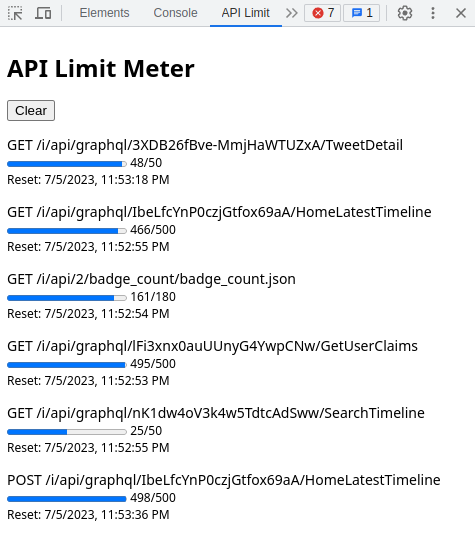

# ApiLimitMeter
A Browser Extension for Checking API Limits.

This extension displays information about API limits included in the response headers (x-rate-limit-limit, x-rate-limit-remaining, and x-rate-limit-reset).

## Installation
### Installation as an unpacked extension
1. Clone this repository.
2. Load the "chrome-extension" directory in Chrome as an unpacked extension.

# Usage
1. Navigate to the webpage where you want to check API limits and open the devtools window.
2. Switch to the devtools panel named "API Limit".

